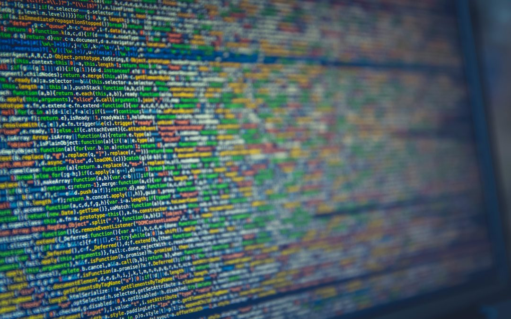

```{r setup, include=FALSE}
knitr::opts_chunk$set(echo = TRUE)
library(tidyverse)
library(readxl)
UB <- read_xlsx("Unemployment_Benefits_ State.xlsx") 
```


<br><br>

Transparency is a foundational issue/ topic in the discussions made by
the author, Cathy O'Neil, in the book "Weapons of Math Destruction".

<div id="picLeft">

Source: myvetahealth.com/healthcare-data-transparency/
</div>

In my opinion, Transparency is necessary to have.

“mathematical  models  were  opaque,  their  workings  invisible  to all  but  the  highest  priests  in  their  domain:  mathematicians  and  computer scientists.” (Pg. 10-11) Here narrowing down on transparency is the issue of opacity. It means being able to see through the inner workings of the models to gain an understanding of how it works and how it draws conclusions.
For example in the case of Wysocki, “Wysocki,  of  course,  felt  the  numbers  were  horribly  unfair,  and  she wanted  to  know  where  they  came  from.  [she didn't] think  anyone  understood them” (Pg. 12)

“Wysocki’s  inability  to  find  someone  who  could  explain  her  appalling score,  too,  is  telling.  Verdicts  from  WMDs  land  like  dictates  from  the algorithmic  gods.  The  model  itself  is  a  black  box “(Pg. 14)


<br>Image by Julie Bang © Investopedia 2019

<br>
It’s consequence is that “Their  verdicts,  even  when  wrong  or  harmful,  were  beyond dispute or appeal.” and they are are. (Pg. 11)

<br><hr><br>

“WMDs, as we’ll see, often punish individuals who happen to be the exception.” (Pg. 13) As WMDs deal with large numbers, in many people’s opinions’, these exceptions are unavoidable consequences. But it's only unavoidable due to the lack of transparency. “The Constitution’s  implicit  judgment  is  that  freeing  someone  who  may  well have committed a crime, for lack of evidence, poses less of a danger to our society than jailing or executing an innocent person” (Pg. 85) Accordingly, it means that having exceptions and collateral damage of a few people for greater number of people is not okay. In the author's own words, “if the details are hidden, it’s also harder to question the score or to protest against it.” (Pg. 15) which means if the details are transparent, these "exceptions" can bring to light the fact that their scores can't be evaluated the same way as for the larger group. At least this gives them the ability to fight for justice and fairness as "Our legal traditions lean strongly toward fairness" (Pg. 85) and models should not be taking it away.
<br><br>
<div id="picLeft">

<br>
Source : www.pinterest.com/pin/363806476142918525/
</div>
<hr> <br>

One may argue that transparency is good in some instances but in other instances, it is not .“if  the  people  being evaluated  are  kept  in  the  dark,  the  thinking  goes,  they’ll  be  less  likely  to attempt  to  game  the  system.” (13-14) Is that really true though and to what extent would people game the system? Information is most useful when it’s exclusive. So, when only a small group of people have access to the information, they are more capable of taking advantage of the system than when everyone has access to it. 

<br>

A person, within the working age, who doesn't have a job and is actively looking for one within the last 30 days, is considered unemployed. Unemployment benefits are provided to such individuals as financial assistance, for several weeks, until they find a new job. It differs from state to state.  Having the knowledge that if they have proof of looking for a job in the last 30 days, they can maximize their benefits, some select individuals send one application to a company they know is gonna reject them. One time, I was talking about this with someone. Among other things she said, “for how long?”
<br>

(Here is a dataset that contains the maximum benefits offered by different states along with the maximum weeks these benefits are offered.)
**Highest benefits among all the states**
```{r echo=FALSE}
# Data Source : https://cashmoneylife.com/unemployment-benefits-by-state/

UBhigh <- arrange(UB, desc(Benefits)) %>%
  filter(Benefits >700)
knitr::kable(UBhigh)

```
<br>
**Lowest benefits among all the states**
```{r echo=FALSE}

UBlow <- arrange(UB, Benefits) %>%
  filter(Benefits < 250)
knitr::kable(UBlow)

```
<br>
**Least No. of maximum weeks a person can get unemployment benefits.**
```{r echo=FALSE}

UBweek <- arrange(UB, Weeks) %>%
  filter(Weeks < 20)
knitr::kable(UBweek)

```

```{r}

```


<br>
<br>
As in the data above, the number of weeks that a person can get these benefits are quite limited and also vary state by state. Even the amount of benefits vary which is likely as a result of state's economy and how expenses it is to live in that state. "Research shows that the unemployed exert a high level of effort to find work. This is *especially true for those receiving unemployment insurance benefits.* Those who have exhausted their unemployment benefits search less intensely for work, but are also willing to accept work that pays considerably less than their prior job." (Citation 2). Despite a small number of people taking advantage of it, it can’t last very long. People and even government should rather have transparency in unemployment benefits which would allow more qualified people to successfully get it despite some taking advantage of it. 

<br>
Hence, Transparency is necessary. It has the greater potential to give people the ability to make their own decisions about their life, fight for justice and fairness, reduce or even remove collateral damage because even one person as collateral damage should not be justified unless the person making the justification is willing to be *the collateral damage.* Perhaps in spite of that, it's not acceptable.


<br>
<hr>
<br>

##### Citation:

1.   Weapons of Math Destruction, Cathy O'Neil, First edition, Crown Publishers, 2016
2.   ["How Do Unemployment Benefits Relate to Job Search Behavior?"](https://www.chicagofed.org/publications/chicago-fed-letter/2020/441)
3.   [Data Source](https://cashmoneylife.com/unemployment-benefits-by-state/)

<br>
<hr>

