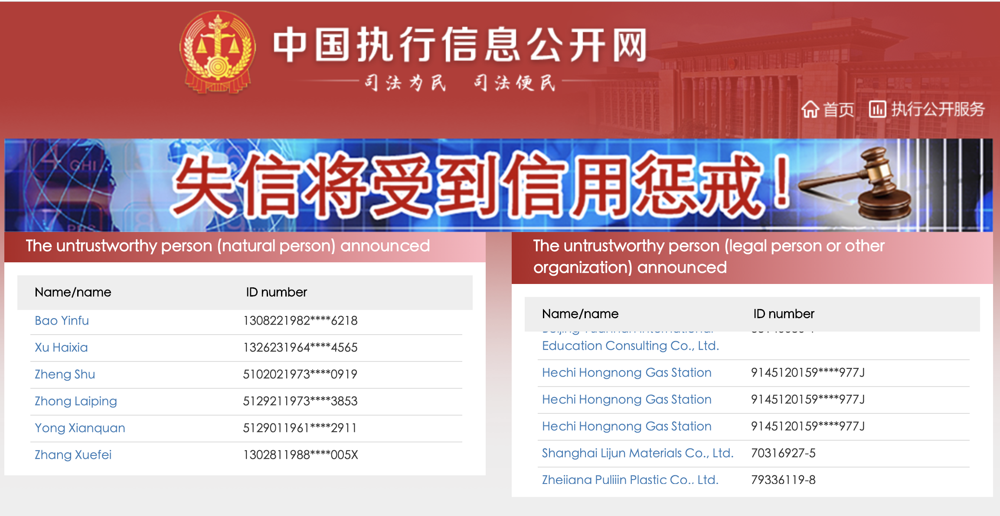

```{r setup, include=FALSE}
knitr::opts_chunk$set(echo = TRUE)
library(tidyverse)
library(readxl)
library(xlsx)
# Reading data in from xlsx spreadsheet files
city <- read_xlsx("city_level_SCS.xlsx")
fuzhou <- read_xlsx("SCS_rewards_punishment.xlsx")
ficoC <- read_xlsx("fico_score_city.xlsx")

# Renaming city dataset headers to make my analysis easier
city <- city%>%
  rename(
    System = `Scoring System`,
    Base = `Base Point`
  )

# Renaming fico city dataset headers to make my analysis easier
ficoC <- ficoC %>%
  rename(
    pRank = 'Percentile_Rank',
    avgScore = 'Median_Credit_Score',
    CI_Ratio = 'Credit_Card_Debt_To_Income_Ratio',
    MI_Ratio = 'Mortgage_Debt_To_Income_Ratio',
    CLI_Ratio = 'Car_Loan_Debt_To_Income_Ratio',
    SLI_Ratio = 'Student_Loan_Debt_To_Income_Ratio',
    latePay = 'Late_Payments_Avg'
  )
# knitr::kable(city)
# View(ficoC)

# Renaming fuzhou system dataset headers to make my analysis easier
fuzhou <- fuzhou%>%
  rename(
    Rmin = RMIn
  )
# knitr::kable(fuzhou)


# ficoC Data tidying and manipulation 

# Separating the state data from city column to a separate State column
ficoC <- ficoC %>%
  separate(City, int = c("City", "State"), sep =", ")

# Taking the mean of all cities in the same state, counting the no of cities and
# writing it to a new file.
stateAvg <- ficoC %>%
   group_by(State) %>%
   summarise(meanScore = mean(avgScore), noCity = n())

write.xlsx(stateAvg, file="state_avg.xlsx")


```

<!-- Exploratory Analysis of data------- -->

```{r echo=FALSE}
# Analyzing the city data
#ggplot(city)+
#  geom_freqpoly(aes(Min))+
#  geom_freqpoly(aes(Max))
# ggplot(city, aes())+
#   geom_point(aes(Location, 'Base Point'))
#   geom_boxplot(aes(Location, Min))

```


```{r echo=FALSE}

# ggplot(ficoC)+
#   geom_histogram(aes(avgScore), binwidth = 1)

# ficoC %>%
#   ggplot()+
#   geom_bar(aes(State))

# stateAvg <- data.frame("State", "meanScore", "noCity")


```


<!-- ------------------------------ -->


\
\

China’s use of facial recognition models for surveillance of its entire population and using it to allegedly control the behavior of its population has long since received much attention and criticism both in the west and the east. Leaving aside my views on this facial recognition model, China has upped its game towards a “Social credit system” (SCS).
\
\
<div id="video">
<iframe width="100%" height="250" src="https://www.youtube.com/embed/MkILQ6D2m_I" frameborder="0" allow="accelerometer; autoplay; clipboard-write; encrypted-media; gyroscope; picture-in-picture" allowfullscreen></iframe>
</div>

SCS is inspired by the credit scoring systems from the West such as FICO scores used by credit card companies in the United States. However, the SCS takes it a step further. In addition to taking in a person’s financial information, it includes multiple aspects of a person’s life. For example, their purchase history, political activities—even small activities like jaywalking could hurt your score. According to O’Neil, a WMD is a mathematical algorithm that generates a scoring system and evaluates people in various ways. This is clearly a potential Weapon of Math Destruction (WMD). The implications of which would entrench in every corner of Chinese society.


There are multiple reasons SCS qualifies as a WMD. This system, dubbed “the greatest ambitious experiment in digital social control ever undertaken” [1] at first glance seems a catastrophe that’s brewing up. Its scale is particularly worrying. 
\
\

```{r echo=FALSE, fig.width=7, fig.height=4, out.extra='style="float:right; padding-left:15px; padding-top:7px;"'}
# Analyzing the fico city data

# Arranging the new data frame of average score in each state in descending
# order. Then taking the top and bottom 5 rows into a new data frame
high_low <- stateAvg %>%
  arrange(desc(meanScore))%>%{
  rbind(head(., 5), tail(., 5))
}


high_low %>% mutate(Legend = ifelse(meanScore <= 700, "Lowest Score", "Highest Score")) %>%
  ggplot(aes(State, meanScore, color=Legend))+
  geom_point(size= 3)+
  labs(x = "US States", y="Mean Score")


```

In the O’Neil’s WMD book, a reason FICO score is not considered a WMD is because it only takes a person’s financial information and past financial history into account which limits human bias into the model. The graph on the right plots US States against the mean FICO score. Among 51 states, 5 highest and lowest scoring are plotted and we can clearly see the difference in the average FICO score of people in different states. Now, does this mean that a person residing in one of the states with the lowest FICO score is considered more likely to default and should be charged a higher interest rate or not given equal access to loans in contrast to someone residing in one of the states with highest average score? If a variable such as geography is taken into consideration, that would precisely make the score an e-proxy and a WMD . And geography is just one of the many variables that SCS is set to take into account. Thus, SCS can be considered an  e-proxy which when legalized on a national scale, definitely counts as a WMD.  

According to the Chinese government, SCS is intended to increase trust and accountability in Chinese society. Accountability maybe, but most likely to an extreme level that makes one uncomfortable. Imagine having to be accountable for even a simple quarrel with neighbors, expressing your opinions, etc. As for trust, it might increase distrust in response to the fear of getting reported for small actions.

Each citizen is expected to be given a social credit score that will increase or decrease depending on whether the subject’s social behavior is acceptable. Who gets to decide what behavior is acceptable and to what degree? Is it justified for an individual or algorithm to get to decide that? Should there really be a black and white line in terms of what is socially acceptable?

\


One might argue that it has the potential to do a lot of good. But like most systems that are implemented on a large scale, the SCS presents an inability to address every person justly.

```{r echo=FALSE, fig.width=7, fig.height=4, out.extra='style="float:right; padding-left:10px; padding-top:7px;"'}
# Showing the different between the Max Penalty and Rewards
ggplot(fuzhou)+
  geom_freqpoly(aes(Pmax, color="Max Penalty"), binwidth=40, na.rm = TRUE)+
  geom_freqpoly(aes(Rmax, color="Max Rewards"), binwidth=40, na.rm = TRUE)+
  labs(x="Reward and Penalty points")
```

In this graph, reward and penalty points are plotted against count ( the number of times it occurs in the system). We can see the system of rewards and penalty is largely skewed towards punishing. Particularly noticeable is the large penalty at 1000 points while there is a stark lack of equivalent reward points. It lacks a balance which means it is a lot easier to lose points than gain them back. One consequence of this, is the likely scenario of someone falling below a certain number of points, forming a prison.

Consider Loren Fei, the 30-year-old-daughter of a silk factory owner, who has been added to a blacklist of businesses and their owners. Because her father couldn’t pay his bills, she said, her bank accounts have been frozen and she lost her job and her ability to travel. “My family really wants to pay back the money, and the system is making it impossible,” Ms. Fei said [4]. Looking at this case, it seems to have the potential to become a prison of unimaginable scale, one that is as implicit as it can be while also being as explicit as it can be. Implicit because it’s not a literal prison but rather creates one around an individual or organization on the other hand, explicit because it can be clearly described and felt by everyone.


\
<!-- <div id="shaming"> -->

<!-- </div> -->

Another aspect of SCS is public shaming. If the SCS score of a person or organization falls too low, they are put on an untrustworthy person list as can be seen in the picture above. This list is a database published in the public domain. The  consequences of that for both an individual or organization in a competitive society is horrifying. It’s still live and can be seen on this [site](http://zxgk.court.gov.cn/shixin/).

Like many other WMDs mentioned in O’Neil’s book, SCS is codifying the past in it’s algorithm by what is socially acceptable. A society evolves and what is socially acceptable typically changes slowly, with occasional spikes in variation. This positive feedback isn’t integrated in this model. No matter who is responsible for updating the data measures, it is bound to include the bias of “fallible human beings”. [11]

According to Dr. O’Neil, the three primary things which identify a WMD are scale, secrecy, and destructiveness. [11] The scale of SCS checks off as SCS is set to affect at least approx. 1.4 billion chinese population out of 7.8 billion world population [12]. Secrecy from normal people is bound to happen as the data collected by the government cannot be made public. No one would ever want all their personal data to be made public, so only the score produced by the model after data crunching can be public. When the first two check off, the last one occurs as an added consequence.


Taking into consideration all the factors that O’Neil uses to define Weapons of Math Destruction, unless the model changes, SCS is a WMD in creation, perhaps the greatest of its kind in history.


\

- - -

\

***References:***

1. [An Introduction to China’s Social Corporate Credit System](https://nhglobalpartners.com/chinas-social-credit-system-explained/)
2. [Corporate Social Credit System in China: How To Check Your Status](https://nhglobalpartners.com/china-corporate-social-credit-system-check-status/)
3. [How the West Got China's Social Credit System Wrong](https://www.wired.com/story/china-social-credit-score-system/)
4. [China Scores Businesses, and Low Grades Could Be a Trade-War Weapon](https://www.nytimes.com/2019/09/22/business/china-social-credit-business.html?searchResultPosition=1)
5. [China's Social Credit System: Data, Algorithms and Implications](https://www.researchgate.net/publication/340245981_China's_Social_Credit_System_Data_Algorithms_and_Implications)
6. [We’re just data: Exploring China’s social credit system in relation to digital platform ratings cultures in Westernized democracies](https://journals.sagepub.com/doi/full/10.1177/2059436419856090)
7. [What do young Chinese think about social credit? It's complicated](https://merics.org/en/report/what-do-young-chinese-think-about-social-credit-its-complicated)
8. [China's Social Credit System is pegged to be fully operational by 2020 — but what will it look like?](http://abc.net.au/news/2020-01-02/china-social-credit-system-operational-by-2020/11764740)
9. [What is China’s social credit system and why is it controversial?](https://www.scmp.com/economy/china-economy/article/3096090/what-chinas-social-credit-system-and-why-it-controversial)
10. [Data scientist Cathy O’Neil on the cold destructiveness of big data](https://qz.com/819245/data-scientist-cathy-oneil-on-the-cold-destructiveness-of-big-data/)
11. Google
12. [Hundreds of Chinese citizens told me what they thought about the controversial social credit system](https://theconversation.com/hundreds-of-chinese-citizens-told-me-what-they-thought-about-the-controversial-social-credit-system-127467)
13. [China’s Chilling ‘Social Credit’ Blacklist](https://www.hrw.org/news/2017/12/12/chinas-chilling-social-credit-blacklist)

***Dataset:***

1. [Credit Score by City](https://wallethub.com/edu/best-cities-at-money-management/19256)
2. [Sample of one city's citizen social scoring pilot system: penalized and rewarded behavior](http://socialcredit.triviumchina.com/what-is-social-credit/citizen-social-credit/#citizen-social-credit-penalties-rewards)


